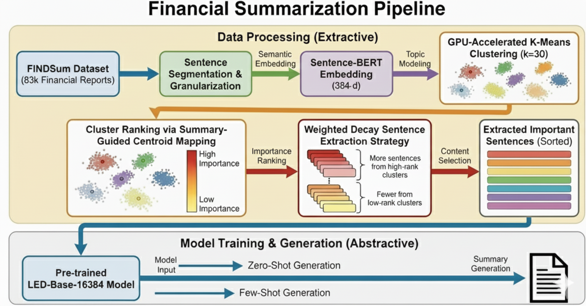
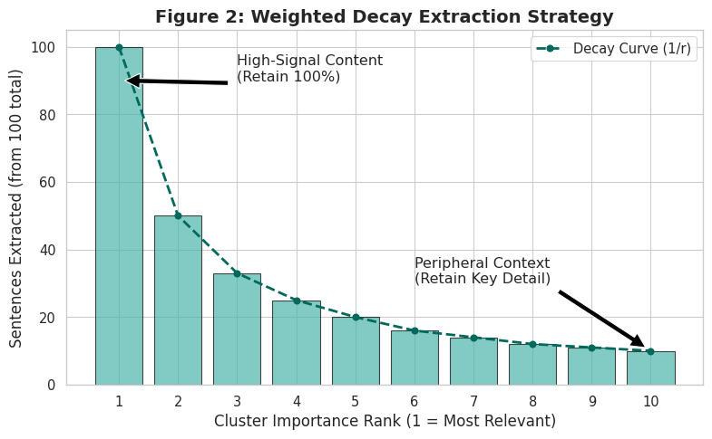
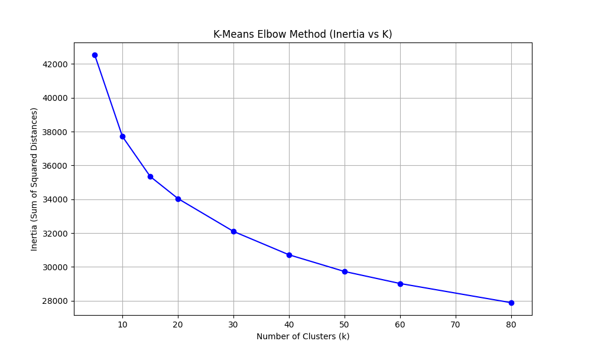
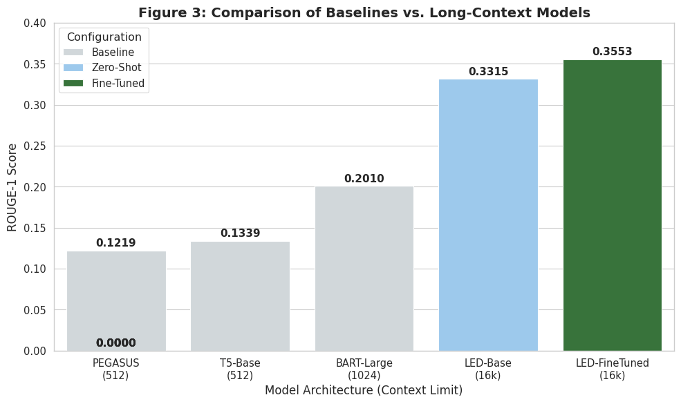
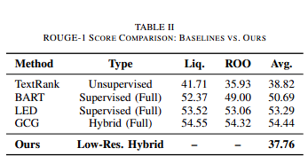
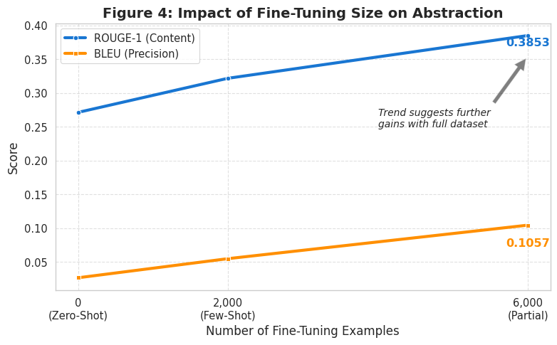
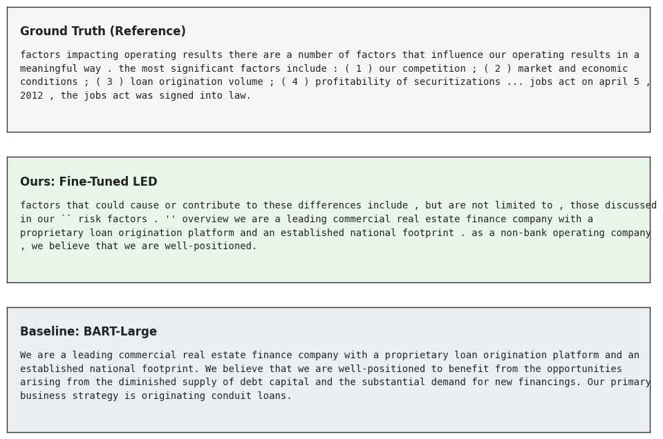

## Project Architecture

### Overall Pipeline



### Weighted Decay Extraction Strategy



---

## Experimental Results

### K-Means Elbow Analysis



### Model Performance Comparison



### ROUGE Score Comparison



### LED Fine-Tuning Curve



### Example Generated Summaries




\# Hybrid Extractive-Abstractive Financial Summarization


\## Overview


This repository contains the implementation of the research project:


\*\*Hybrid Extractive-Abstractive Summarization of Financial Narratives via Unsupervised Semantic Clustering and DistilBERT Scoring\*\*


The proposed framework addresses the challenge of summarizing extremely long financial reports (Form 10-K) by combining:


\- Semantic Sentence Embeddings

\- K-Means Clustering

\- DistilBERT-based Sentence Ranking

\- Longformer Encoder-Decoder (LED) Abstractive Summarization


The system follows a \*\*Cluster-Rank-Abstract\*\* pipeline designed for low-resource environments and Green AI research.


\---


\## Research Motivation


Financial reports often exceed 50,000 tokens, making them difficult to process using standard Transformer architectures.


This project proposes a hybrid solution that:


1\. Maps document structure through semantic clustering.

2\. Identifies important content using DistilBERT scoring.

3\. Generates coherent summaries using LED.

4\. Reduces computational requirements while maintaining competitive performance.


\---


\## System Architecture


```text

Financial Report (10-K)

&#x20;         │

&#x20;         ▼

Sentence Segmentation

&#x20;         │

&#x20;         ▼

Sentence Embeddings (MiniLM)

&#x20;         │

&#x20;         ▼

K-Means Clustering

&#x20;         │

&#x20;         ▼

Reference-Guided Density Ranking

&#x20;         │

&#x20;         ▼

DistilBERT Sentence Scoring

&#x20;         │

&#x20;         ▼

Weighted Decay Extraction

&#x20;         │

&#x20;         ▼

LED Fine-Tuning

&#x20;         │

&#x20;         ▼

Abstractive Summary Generation

```


\---


\## Models


\### Fine-Tuned LED Model (This Research)


Kaggle Model:


https://www.kaggle.com/models/mariamahnoor34214/finetuned-led/Transformers/default/1


Description:

\- Fine-tuned on FINDSum subset

\- Trained using approximately 17% of available data

\- Used for final abstractive summary generation


\### Baseline Models


\#### BART-Large-CNN


https://www.kaggle.com/refs/hf-model/facebook/bart-large-cnn


Used as:

\- Zero-shot summarization baseline


\#### LED-Base-16384


https://www.kaggle.com/refs/hf-model/allenai/led-base-16384


Used as:

\- Long-document baseline

\- Base model for fine-tuning


\---


\## Datasets


Due to GitHub storage limitations, datasets are hosted on Kaggle.


\### Sentence Embeddings Dataset


https://www.kaggle.com/datasets/mariamahnoor34214/sentence-embeddings-dataset


Contents:

\- MiniLM sentence embeddings

\- 384-dimensional vector representations


Size:

\- Approximately 7 GB


\---


\### Clustered Dataset


https://www.kaggle.com/datasets/mariamahnoor34214/clustered-dataset


Contents:

\- K-Means clustering outputs

\- Cluster assignments

\- Topic representations


Size:

\- Approximately 285 MB


\---


\### FINDSum Sentences Dataset


https://www.kaggle.com/datasets/mariamahnoor34214/findsum-sentences


Contents:

\- Processed sentence-level financial narratives

\- Training data for clustering and scoring


Size:

\- Approximately 281 MB


\---


\## Methodology


\### Stage 1: Semantic Clustering


Embedding Model:

\- all-MiniLM-L6-v2


Clustering:

\- K-Means

\- K = 30 clusters


Purpose:

\- Discover latent financial topics

\- Reduce redundancy

\- Improve content coverage


\---


\### Stage 2: Sentence Importance Ranking


Model:

\- DistilBERT


Purpose:

\- Rank extracted sentences

\- Identify high-value financial information


Strategy:

\- Reference-Guided Density Ranking

\- Weighted Decay Extraction


\---


\### Stage 3: Abstractive Generation


Model:

\- Longformer Encoder Decoder (LED)


Advantages:

\- 16,384 token context window

\- Long-document summarization

\- Reduced truncation effects


\---


\## Experimental Setup


\### Hardware


\- NVIDIA Tesla T4

\- 16 GB VRAM


\### DistilBERT Fine-Tuning


| Parameter | Value |

|------------|--------|

| Epochs | 1 |

| Batch Size | 16 |

| Learning Rate | 2e-5 |


\### LED Fine-Tuning


| Parameter | Value |

|------------|--------|

| Epochs | 1 |

| Learning Rate | 3e-5 |

| Beam Size | 4 |

| Training Data | 17% |


\---


\## Results


\### Model Performance Comparison


| Model | Configuration | ROUGE-1 | ROUGE-2 | ROUGE-L | BLEU |

|---------|-------------|---------|---------|---------|------|

| BART-Large | Zero-Shot | 20.10 | 5.11 | 12.11 | 0.66 |

| LED-Base | Zero-Shot | 33.65 | 10.12 | 17.41 | 6.35 |

| LED-FT (Ours) | 17% Data | 37.76 | 12.25 | 18.52 | 10.57 |


\---


\### Comparison Against FINDSum Baselines


| Method | Type | Liquidity | ROO | Average |

|----------|----------|----------|----------|----------|

| TextRank | Unsupervised | 41.71 | 35.93 | 38.82 |

| BART | Supervised (Full) | 52.37 | 49.00 | 50.69 |

| LED | Supervised (Full) | 53.52 | 53.06 | 53.29 |

| GCG | Hybrid (Full) | 54.55 | 54.32 | 54.44 |

| Ours | Low-Resource Hybrid | – | – | 37.76 |


\---


\## Repository Structure


```text

Hybrid-Extractive-Abstractive-Financial-Summarization/

│

├── notebooks/

│   ├── finetune\_LED\_ABS.ipynb

│   ├── LED\_finetuning.ipynb

│   ├── kmeans\_1250\_abstraction.ipynb

│   ├── kmeans\_extracted\_sentences.ipynb

│   └── hdbs\_clustered.ipynb

│

├── papers/

│   └── Research\_Paper.pdf

│

├── models/

│   └── README.md

│

├── results/

├── data/

│

├── README.md

└── .gitignore

```


\---


\## Key Contributions


\- Hybrid Extractive-Abstractive Summarization

\- Semantic Clustering for Long Financial Documents

\- DistilBERT-Based Sentence Ranking

\- LED Fine-Tuning Under Low-Resource Constraints

\- Green AI Approach for Financial NLP


\---


\## Author


\*\*Maria Mahnoor\*\*


Research Areas:

\- Natural Language Processing

\- Financial Document Summarization

\- Transformer Models

\- Long Document Understanding

\- Green AI

